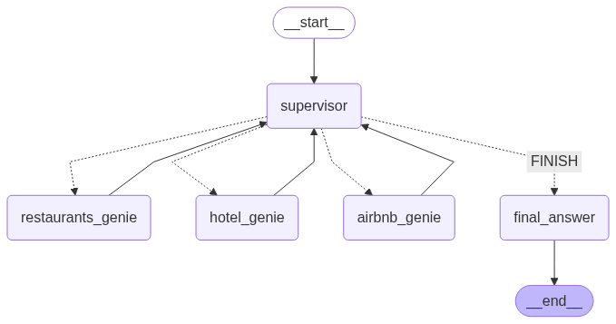

# Hackathon Project: Wellness Pathway

📅 Event: Data and AI Summit

🛠️ Team: Wellness Pathway
   - Deepak Sharma 
   - Shan Venugopal
   - Seng Chu
   - Ethan Ma

📍 Date: [06/09/2025]

♿ Project Overview: Wellness Pathway – an AI-Powered Accessibility Travel Companion

---------------------------
🌟 Vision
---------------------------
Wellness Pathway is an intelligent, AI-powered application designed to help people with disabilities or accessibility needs find suitable accommodations, restaurants, hotels, and Airbnb listings. It ensures that users can confidently plan their travel and daily activities with personalized, accessibility-aware recommendations.

---------------------------
🧠 Core Technology
---------------------------
Databricks Genie Multi-Agent Framework powers the backend intelligence of Wellness Pathway. The system uses a multi-agent architecture where each agent specializes in a specific domain (e.g., lodging, dining, transportation, accessibility compliance), and they collaborate to fulfill complex user queries.

---------------------------
🧩 Key Components
---------------------------

1. Databricks Genie Agents

 - Supervisor Agent: Interprets user intent and routes tasks and collects final answers
 - Restaurant Agent: Searches restaurants with accessibility filters
 - Hotel Agent: Recommends hotels with wheelchair access, braille menus, etc.
 - Airbnb Agent: Verifies ADA or local accessibility compliance for Airbnb

2. LLM Integration
Powered by Llama for natural language understanding and generation
Handles multi-turn conversations and follow-up questions

---------------------------
📄 License
---------------------------
This project is licensed under the MIT License.

---------------------------
🙌 Acknowledgments
---------------------------
Thanks to [Databricks], and the open data providers who made this project possible.# wellnesspathway
databricks DAIS 25' Hackathon
